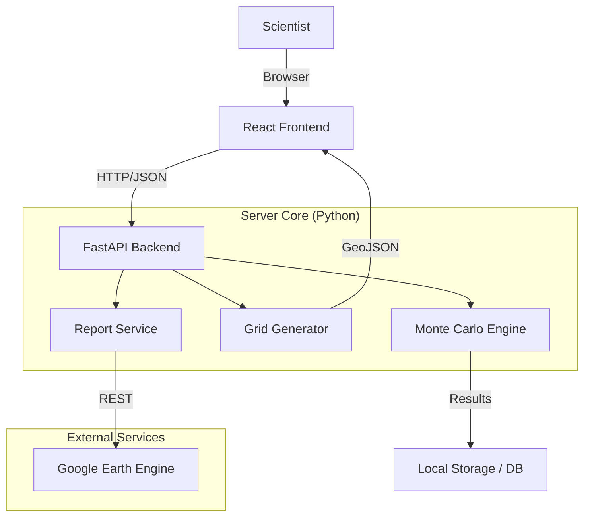

# 🚀 Rocket Drop Zone Analysis (OTU) System

<!-- 
LANGUAGES / ЯЗЫКИ / ТІЛДЕР 
-->
<div align="center">

[](https://www.python.org/)
[](https://fastapi.tiangolo.com/)
[](https://react.dev/)
[](LICENSE)
[]()

[🇬🇧 English](#-english-documentation) | 
[🇷🇺 Русский](#-русская-документация) | 
[🇰🇿 Қазақша](#-қазақша-құжаттама)

</div>

---

# 🇬🇧 English Documentation

## 1. Introduction

**Rocket Drop Zone Analysis (OTU)** is a specialized software suite designed for aerospace environmental monitoring. Its primary purpose is to simulate, analyze, and assess the impact of rocket stage separation (Separating Parts of Launch Vehicles - SPLV/OTU) on terrestrial ecosystems.

The system employs **Monte Carlo simulations** to predict probabilistic impact ellipses and integrates with **Google Earth Engine (GEE)** to retrieve real-time satellite imagery (Sentinel-2) for ecological assessment.

### Key Capabilities
- **Probabilistic Modeling**: Simulation of 1000+ trajectories to determine 3-sigma safety zones.
- **Ecological Impact Assessment**: Automated calculation of NDVI (Vegetation), Water Indexes (NDWI), and Soil Stability.
- **Economic Analysis**: Estimation of land restoration costs based on biomass loss and soil degradation.
- **Visual Analytics**: Interactive 3D/2D maps via Leaflet and React.

---

## 2. Architecture & Tech Stack

The system follows a modern **Client-Server** architecture, containerized for easy deployment.



### Components
1.  **Backend (`/api`)**: Built with **FastAPI**. Handles simulation logic, coordinate transformations (PyProj), and GEE data fetching.
2.  **Frontend (`/gui`)**: A **React + Vite** application providing an interactive map interface.
3.  **Core Logic (`/server_pipeline`)**: Contains the scientific algorithms for grid generation and ellipse calculation.
4.  **Telemetry (`/telemetry`)**: (Optional) Module for recording reproducible scientific data.

---

## 3. Mathematical Methodology

### 3.1. Stochastic Ballistic Model (Monte Carlo)
The impact point $P(x, y)$ is determined by integrating the equations of motion with stochastic initial conditions. We execute $N=1000+$ iterations for each simulation.

The state vector $S = [h, v, \gamma, \psi]$ (altitude, velocity, path angle, azimuth) is perturbed as follows:

$$
\begin{aligned}
h_0 &\sim \mathcal{N}(\mu_h, 2000^2) \\
v_0 &\sim \mathcal{N}(\mu_v, 150^2) \\
\gamma_0 &\sim \mathcal{N}(\mu_\gamma, 4^\circ) \\
\psi_0 &\sim \mathcal{N}(\text{Azimuth}, 3^\circ)
\end{aligned}
$$

Where $\mathcal{N}(\mu, \sigma^2)$ is the normal distribution.

### 3.2. Fragment Dispersion Logic
If a breakup event occurs (probability $P_{breakup}$), fragments are generated around a reference point $R_{frag}$ calculated as 70% of the primary stage's ballistic range.

$$
\begin{aligned}
R_{frag} &= 0.7 \cdot R_{primary} \\
\Delta_{downrange} &\sim \mathcal{N}(0, 15000^2) \quad (\text{15 km spread}) \\
\Delta_{crossrange} &\sim \mathcal{N}(0, 12000^2) \quad (\text{12 km spread})
\end{aligned}
$$

### 3.3. Outlier Filtering (IQR Method)
To ensure the safety zone is robust but not excessively large due to extreme outliers, we apply the Interquartile Range (IQR) filter before ellipse fitting:

$$
\begin{aligned}
IQR &= Q_3 - Q_1 \\
Bounds &= [Q_1 - 1.5 \cdot IQR, \quad Q_3 + 1.5 \cdot IQR]
\end{aligned}
$$

Points outside these bounds are excluded from the ellipse calculation.

### 3.4. Impact Ellipse & Grid
The 3-sigma confidence ellipse is derived from the covariance matrix of the filtered points.
The grid $G$ is generated by rasterizing this ellipse into $1 \times 1$ km cells.

$$
\text{Cell}(i, j) \in \text{Zone} \iff \text{Polygon}_{ellipse} \text{ contains } \text{Center}(i, j)
$$

The system enforces a safety cap of **50,000 cells** to prevent memory overflow during ecological analysis.

---

## 4. Installation & Setup

### Prerequisites
- **Python 3.10+**: Core runtime.
- **Node.js 18+**: For the web interface.
- **Google Earth Engine Account**: For satellite data access.

### Step-by-Step Guide

#### A. Backend Setup
1.  Navigate to the repository root.
2.  Create a virtual environment (recommended):
    ```bash
    python -m venv .venv
    .venv\Scripts\activate
    ```
3.  Install dependencies:
    ```bash
    pip install -r requirements.txt
    ```
4.  Authenticate with GEE:
    ```bash
    earthengine authenticate
    ```

#### B. Frontend Setup
1.  Navigate to `gui/`:
    ```bash
    cd gui
    ```
2.  Install packages:
    ```bash
    npm install
    ```

---

## 5. Usage

### Starting the System
You can use the provided helper scripts:

1.  **Backend**: Run `run_server.py`.
    -   *Console output should show: `Uvicorn running on http://0.0.0.0:8000`*
    
2.  **Frontend**: Run `run_frontend.bat`.
    -   *Opens browser at `http://localhost:5173`*

### Workflow
1.  **Select Zone**: Choose a pre-defined drop zone or enter coordinates.
2.  **Configure Parameters**:
    -   Separation Altitude (km)
    -   Velocity (m/s)
    -   Wind Deviation estimates
3.  **Run Simulation**: Click "Run Monte Carlo".
4.  **Analyze Results**: View the generated heatmaps.
5.  **Export Report**: Click "Export Data". The system will generate a ZIP file containing:
    -   `1_otu_extended_analysis.csv` (Raw Data)
    -   `5_economic_summary.csv` (Cost Estimates)
    -   Maps and metadata.

---

## 6. Directory Structure

| Path | Description |
|------|-------------|
| `api/` | REST API endpoints (`main.py`, `models.py`) |
| `core/` | Base configuration and logging logic |
| `gee/` | Google Earth Engine integration scripts |
| `grid/` | Polygon rasterization and grid algorithms |
| `gui/` | Frontend source code (React) |
| `outputs/` | Generated files (CSVs, Maps) |
| `server_pipeline/` | Scientific logic orchestration |
| `telemetry/` | Reproducibility logs |
| `run_server.py` | Entry point for Backend |

---

## 7. Troubleshooting

### Common Issues

**Q: "ModuleNotFoundError: No module named 'fastapi'"**
*   **A**: You forgot to activate the virtual environment or run `pip install -r requirements.txt`.

**Q: "GEE Authentication Error"**
*   **A**: Run `earthengine authenticate` in your terminal and follow the browser prompts.

**Q: Map not loading in browser**
*   **A**: Ensure the backend is running on port 8000. Check the browser console (F12) for CORS errors.

---

<br><br><br>

# 🇷🇺 Русская Документация

## 1. Введение

**Rocket Drop Zone Analysis (OTU)** — это программный комплекс для экологического мониторинга и баллистического анализа. Система предназначена для моделирования зон падения отделяющихся частей ракет-носителей (ОЧРН) и оценки ущерба окружающей среде.

Мы используем **Метод Монте-Карло** для построения полей рассеивания и **Google Earth Engine** для анализа поверхности земли (спутниковые снимки Sentinel-2).

### Ключевые Возможности
- **Моделирование Траекторий**: Расчет 1000+ вероятностных точек падения с учетом ветра и отклонений тяги.
- **Экологическая Оценка**: Автоматический расчет вегетационного индекса (NDVI), классификация почв и водных объектов.
- **Экономический Анализ**: Расчет стоимости рекультивации земель.
- **Интерактивная Карта**: Визуализация эллипсов рассеивания (3-сигма).

---

## 2. Архитектура

Система состоит из двух независимых частей: Сервера (Python) и Клиента (React).

1.  **Сервер (Backend)**: Выполняет тяжелые математические расчеты. Использует библиотеки `numpy` и `scipy` для физики, `geopandas` для геометрии.
2.  **Клиент (Frontend)**: Интерфейс для ученого. Позволяет задавать параметры запуска и просматривать результаты на карте.

---

## 3. Математическая Методология

### 3.1. Стохастическая Баллистическая Модель (Монте-Карло)
Точка падения $P(x, y)$ определяется путем интегрирования уравнений движения со случайными начальными условиями. Для каждой симуляции выполняется $N=1000+$ итераций.

Вектор состояния $S = [h, v, \gamma, \psi]$ (высота, скорость, угол наклона, азимут) возмущается следующим образом:

$$
\begin{aligned}
h_0 &\sim \mathcal{N}(\mu_h, 2000^2) \\
v_0 &\sim \mathcal{N}(\mu_v, 150^2) \\
\gamma_0 &\sim \mathcal{N}(\mu_\gamma, 4^\circ) \\
\psi_0 &\sim \mathcal{N}(\text{Азимут}, 3^\circ)
\end{aligned}
$$

Где $\mathcal{N}(\mu, \sigma^2)$ — нормальное распределение.

### 3.2. Логика Рассеивания Фрагментов
В случае разрушения ступени (вероятность $P_{breakup}$), фрагменты генерируются вокруг точки $R_{frag}$, составляющей 70% от баллистической дальности.

$$
\begin{aligned}
R_{frag} &= 0.7 \cdot R_{primary} \\
\Delta_{downrange} &\sim \mathcal{N}(0, 15000^2) \quad (\text{разброс 15 км}) \\
\Delta_{crossrange} &\sim \mathcal{N}(0, 12000^2) \quad (\text{разброс 12 км})
\end{aligned}
$$

### 3.3. Фильтрация Выбросов (Метод IQR)
Для исключения экстремальных отклонений применяется фильтр межквартильного размаха (IQR):

$$
\begin{aligned}
IQR &= Q_3 - Q_1 \\
Границы &= [Q_1 - 1.5 \cdot IQR, \quad Q_3 + 1.5 \cdot IQR]
\end{aligned}
$$

### 3.4. Эллипс Рассеивания и Сетка
Эллипс доверительной вероятности ($3\sigma$) строится на основе ковариационной матрицы отфильтрованных точек. Сетка генерируется внутри полигона эллипса (ячейки $1 \times 1$ км).
Система имеет ограничение в **50,000 ячеек** для предотвращения переполнения памяти.

---

## 4. Установка

### Требования
-   **Python 3.10** или новее.
-   **Node.js 18** (LTS).

### Инструкция

#### Шаг 1: Подготовка Сервера
1.  Скачайте репозиторий.
2.  Откройте терминал в папке проекта.
3.  Установите библиотеки:
    ```bash
    pip install -r requirements.txt
    ```
4.  Авторизуйтесь в Google Earth Engine:
    ```bash
    earthengine authenticate
    ```

#### Шаг 2: Подготовка Интерфейса
1.  Перейдите в папку `gui`:
    ```bash
    cd gui
    ```
2.  Установите зависимости JS:
    ```bash
    npm install
    ```

---

## 5. Использование

Для работы необходимо запустить **два процесса**.

1.  **Запуск API**:
    Запустите файл `run_server.py`. В консоли появится сообщение об успешном старте на порту 8000.

2.  **Запуск GUI**:
    Запустите `run_frontend.bat`. Браузер откроется автоматически.

### Процесс Анализа
1.  Выберите точку старта (космодром) и азимут пуска.
2.  Укажите параметры разделения ступеней (высота, скорость).
3.  Нажмите **"Calculate"**. Система проведет симуляцию.
4.  Перейдите во вкладку **"Export"**, чтобы получить детальные отчеты в формате CSV.

---

## 6. Структура Проекта

Файловая структура организована модульно:

-   `api/` — Точки входа API (контроллеры).
-   `server_pipeline/` — Основные алгоритмы (Grid Generator, Export Service).
-   `gee/` — Скрипты взаимодействия с Earth Engine.
-   `gui/` — Исходный код веб-интерфейса.
-   `outputs/` — Здесь сохраняются результаты ваших тестов.

---

<br><br><br>

# 🇰🇿 Қазақша Құжаттама

## 1. Кіріспе

**Rocket Drop Zone Analysis (OTU)** — бұл зымыран-тасығыштардың бөлінетін бөліктерінің (ББ/OTU) құлау аймақтарын модельдеуге және экологиялық бағалауға арналған арнайы бағдарламалық жүйе.

Жүйе **Монте-Карло әдісін** қолдана отырып, ықтимал құлау эллипстерін болжайды және **Google Earth Engine (GEE)** арқылы жерді қашықтықтан зондтау деректерін (Sentinel-2) талдайды.

### Негізгі Мүмкіндіктер
-   **Траекторияны Модельдеу**: Жел мен қозғалтқыш ауытқуларын ескере отырып, құлау нүктелерін есептеу.
-   **Экологиялық Мониторинг**: NDVI (Өсімдік индексі) және топырақ жағдайын автоматты түрде анықтау.
-   **Экономикалық Талдау**: Жерді қалпына келтіру құнын бағалау.
-   **Визуализация**: Интерактивті карталар мен диаграммалар.

---

## 2. Жүйе Архитектурасы

Жүйе екі негізгі компоненттен тұрады:

1.  **Backend (Сервер)**: Python тілінде жазылған. Күрделі физикалық есептеулерді орындайды.
2.  **Frontend (Клиент)**: React негізінде жасалған веб-интерфейс. Пайдаланушыға нәтижелерді көрсетеді.

---

## 3. Математикалық Әдістеме

### 3.1. Стохастикалық Баллистикалық Модель
Құлау нүктесі $P(x, y)$ қозғалыс теңдеулерін кездейсоқ бастапқы шарттармен интеграциялау арқылы анықталады (Монте-Карло, $N=1000+$ итерация).

Күй векторы $S = [h, v, \gamma, \psi]$ (биіктік, жылдамдық, траектория бұрышы, азимут) төмендегідей ауытқиды:

$$
\begin{aligned}
h_0 &\sim \mathcal{N}(\mu_h, 2000^2) \\
v_0 &\sim \mathcal{N}(\mu_v, 150^2) \\
\gamma_0 &\sim \mathcal{N}(\mu_\gamma, 4^\circ) \\
\psi_0 &\sim \mathcal{N}(\text{Азимут}, 3^\circ)
\end{aligned}
$$

### 3.2. Фрагменттердің Шашырауы
Егер бұзылу орын алса ($0.7 \cdot R_{primary}$ қашықтықта), фрагменттер Гаусс заңы бойынша шашырайды:

$$
\begin{aligned}
\Delta_{downrange} &\sim \mathcal{N}(0, 15000^2) \\
\Delta_{crossrange} &\sim \mathcal{N}(0, 12000^2)
\end{aligned}
$$

### 3.3. Эллипс және Тор
Қауіпсіздік аймағы ($3\sigma$ эллипс) **IQR сүзгісі** арқылы ауытқуларды алып тастағаннан кейін құрылады.
Эллипс ішіне $1 \times 1$ км өлшеміндегі тор (Grid) жасалады (максимум 50,000 ұяшық).

---

## 4. Орнату Нұсқаулығы

### Қажетті құралдар
-   **Python 3.10+** (Сервер үшін).
-   **Node.js 18+** (Интерфейс үшін).
-   **Google Earth Engine** аккаунты.

### Қадамдық Нұсқаулық

#### 1-қадам. Серверді баптау
1.  Жоба бумасын жүктеп алыңыз.
2.  Терминалды ашып, кітапханаларды орнатыңыз:
    ```bash
    pip install -r requirements.txt
    ```

#### 2-қадам. Интерфейсті баптау
1.  `gui` папкасына өтіңіз:
    ```bash
    cd gui
    ```
2.  Пакеттерді орнатыңыз:
    ```bash
    npm install
    ```

---

## 5. Қолдану

Жұмысты бастау үшін екі файлды іске қосу керек:

1.  `run_server.py` — Серверді қосады.
2.  `run_frontend.bat` — Интерфейсті ашады.

Браузерде `http://localhost:5173` мекенжайы ашылғаннан кейін, сіз картадан аймақты таңдап, "Calculate" батырмасын басу арқылы талдау жасай аласыз.

---

## 6. Файлдар Құрылымы

| Папка | Сипаттамасы |
|-------|-------------|
| `api/` | Серверлік код және API. |
| `gui/` | Веб-интерфейс коды. |
| `outputs/` | Есептік файлдар мен нәтижелер сақталатын орын. |
| `gee/` | Жерді қашықтықтан зондтау скрипттері. |

---

## 7. Ақаулықтарды жою (Troubleshooting)

Егер қателер пайда болса:
1.  Python кітапханалары толық орнатылғанын тексеріңіз.
2.  Интернет байланысын тексеріңіз (GEE үшін қажет).
3.  Сервердің `port 8000`-де қосылып тұрғанына көз жеткізіңіз.

---

---

## 8. License & Attribution / Лицензия / Лицензиясы

### 🇬🇧 English
This software was developed specifically for research published in the **Aerospace** journal.
**Vel5id** is the sole author and copyright holder of this codebase.

The code is released under the **MIT License**.
You are free to use, modify, and distribute this software for any purpose (including commercial and scientific), **provided that you explicitly cite the original author** in your product, paper, or derivative work.

### 🇷🇺 Русский
Данный программный комплекс был разработан специально для статьи в журнале **Aerospace**.
Единственным автором и правообладателем кода является **Vel5id**.

Проект распространяется по лицензии **MIT**.
Разрешается свободное использование, модификация и распространение кода в любых целях (включая коммерческие и научные), **при условии обязательного указания авторства** в вашем продукте или научной работе.

### 🇰🇿 Қазақша
Бұл бағдарламалық жасақтама **Aerospace** журналындағы мақала үшін арнайы әзірленген.
Кодтың жалғыз авторы және құқық иесі — **Vel5id**.

Жоба **MIT лицензиясы** аясында таратылады.
Сіз бұл кодты кез келген мақсатта (соның ішінде коммерциялық және ғылыми) еркін пайдалана аласыз, бірақ **авторды міндетті түрде көрсетуіңіз керек**.

---

<br>
<div align="center">
    <i>Developed for Aerospace Research & Environmental Safety.</i>
    <br>
    © 2026 Vladimir. All Rights Reserved.
</div>
